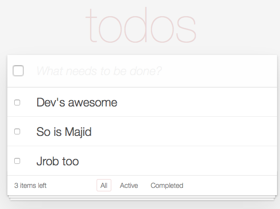

# To Do List

## Description

Complete a todo list app.

## Specifications

- [ ] React Resource page
- [ ] Redux Resource page
- [x] Check items off as completed
- [ ] SPA, one user only:
      - view todos
      - add todos
      - delete todos
      - edit todos
- [ ] Filter:
      - all
      - active
      - completed

## Quality Rubric

- [x] Linting
- [x] Good Git Flow( Feature Branches, PR's ).
- [ ] Clean code
- [ ] Components adhere to SRP
- [ ] ES6
- [x] Using issues to specify tasks

---

- [ ] The artifact produced is properly licensed, preferably with the [MIT license][mit-license].

---

## License
<!-- LICENSE -->

 This work is licensed under a <a rel="license" href="http://creativecommons.org/licenses/by-nc-sa/4.0/">Creative Commons Attribution-NonCommercial-ShareAlike 4.0 International License</a>.

[mit-license]: https://opensource.org/licenses/MIT
